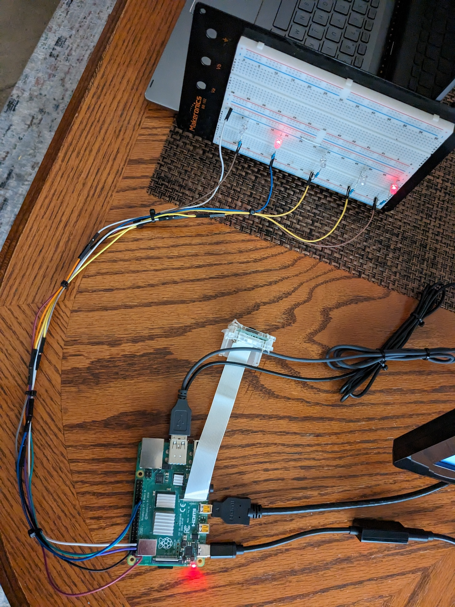

# Count GPT
Docs 11-16-23 V1 (For questions or comments:  Stephen Witty switty@level500.com)  

### Project Overview:

Count GPT is an automated system that measures how well ChatGPT counts LEDs in an image using a Raspberry Pi with an added camera.  The system randomly turns on LEDs, takes a picture, then submits the photo to ChatGPT.  ChatGPT replies back with the number of LEDs turned on.  The accuracy is measured over several test runs.

### Demo Video:
https://youtu.be/GvgNcLHDl_8

### Usage:

- System runs on a Raspberry Pi 4
- Raspberry Pi camera is required
- GPIO outputs 1 through 5 are connected to LEDs with resistors
- The software is a Python3 script and runs in the usual manner
- Install Python lib adafruit-blinka for GPIO
- Install the banner command:  sudo apt-get install sysvbanner
- There is only one source code/script file
- User must enter their OpenAI API key toward the top of the Python script
- Under Constants - assign the number of tests to run
- Under Constants - assign the path and file name for the picture taken